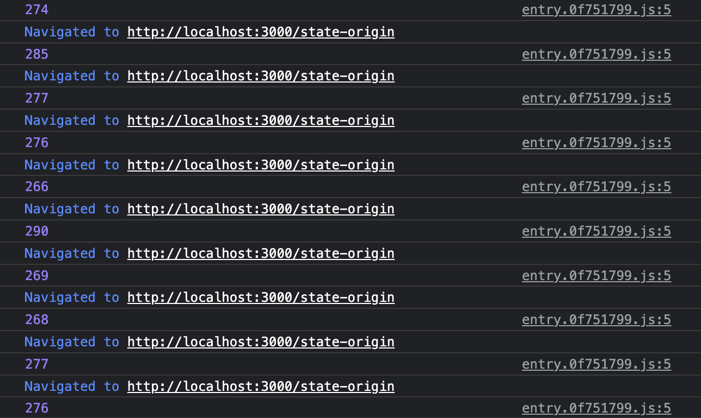
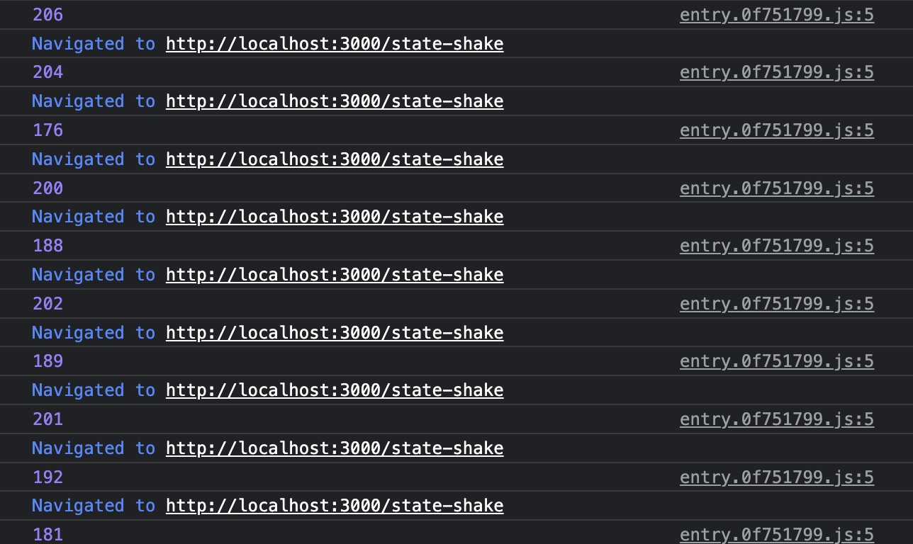

### Test Case

- The [test object](./mock/vrsws.json) is a 6 deeps with each 6 properties object
- The [walker](./walker.ts) reached 80% properties (4 properties) in each deep
- State was inject into document html with `useState`
- Runs on 14' M1 Pro & preview mode

### Measurement

#### Same as `SSR to Full load` in nuxt devtools

> https://github.com/nuxt/devtools/blob/main/packages/devtools/src/runtime/plugins/devtools.server.ts

```ts
// server plugin
export default defineNuxtPlugin(() => {
  const ssrStart = Date.now()
  useState('ssrStart', () => ssrStart)
})
```

---

> https://github.com/nuxt/devtools/blob/main/packages/devtools/src/runtime/plugins/devtools.client.ts

```ts
// client plugin
export default defineNuxtPlugin((nuxt: any) => {
  if (typeof document === 'undefined' || typeof window === 'undefined') return
  nuxt.hook('app:mounted', () => {
    const appLoad = Date.now()
    const ssrStart = useState<number>('ssrStart')
    const ssrToFullLoadTime = appLoad - ssrStart.value

    // SSR to Full load
    console.log(ssrToFullLoadTime)
  })
})
```

### SSR to Full load

|     | http://localhost:3000/state-origin | http://localhost:3000/state-shake | impovements |
| --- | ---------------------------------- | --------------------------------- | ----------- |
|     |     |     |
| avg | ⏰ 276ms                           | ⏰ 194ms                          | 🚀 29.2%    |

### TODO
Need More Test Cases
