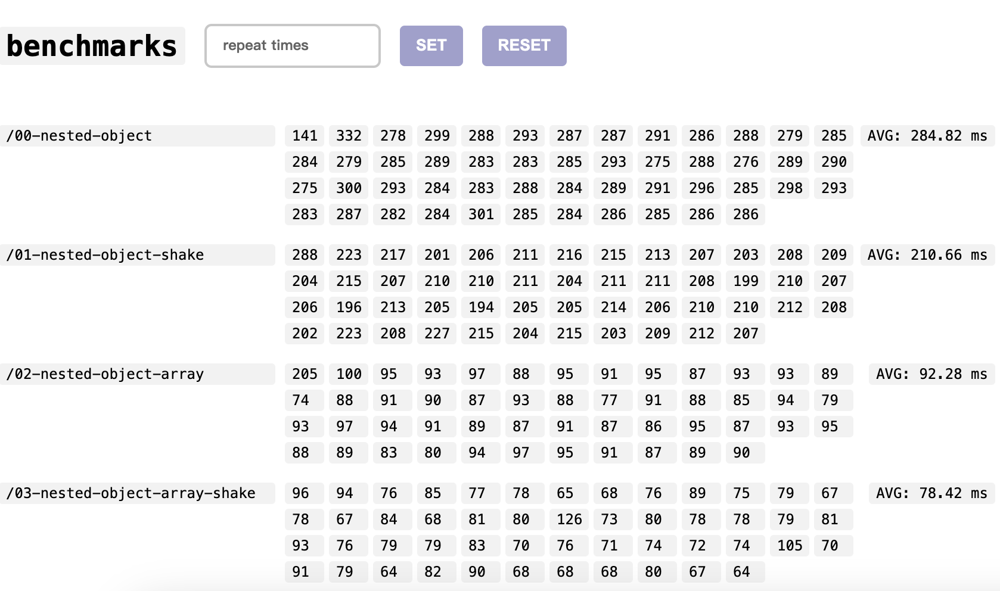
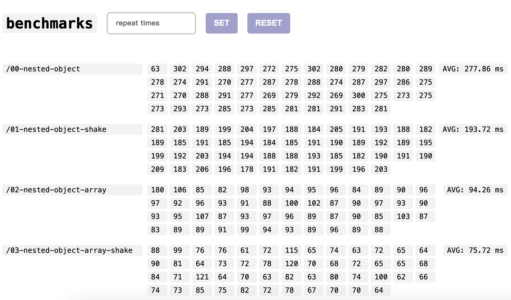
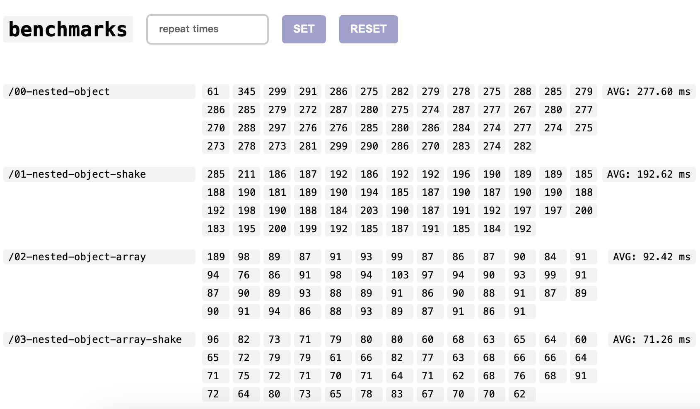
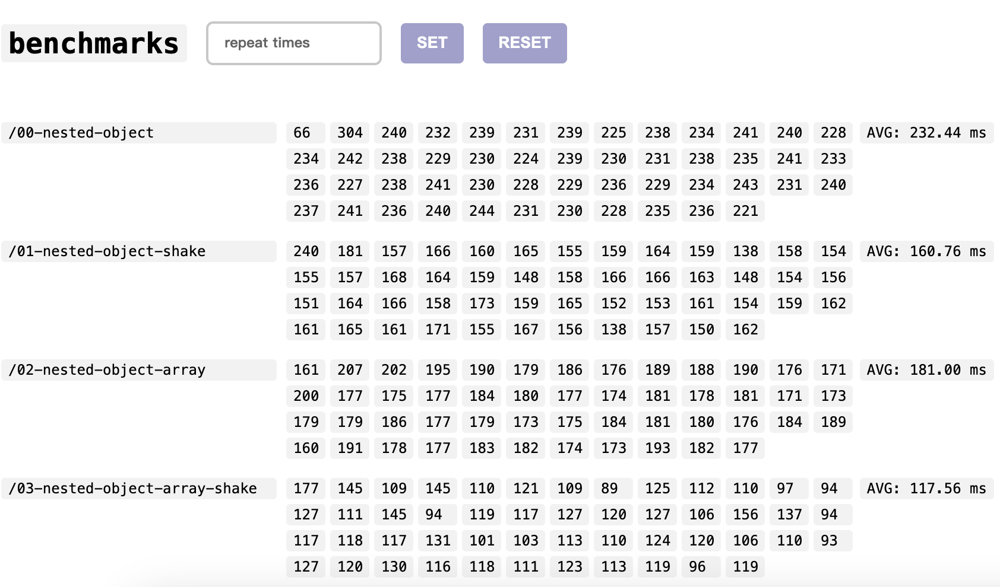
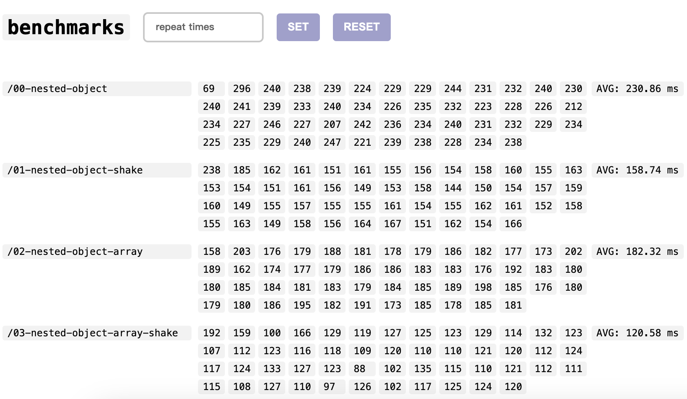
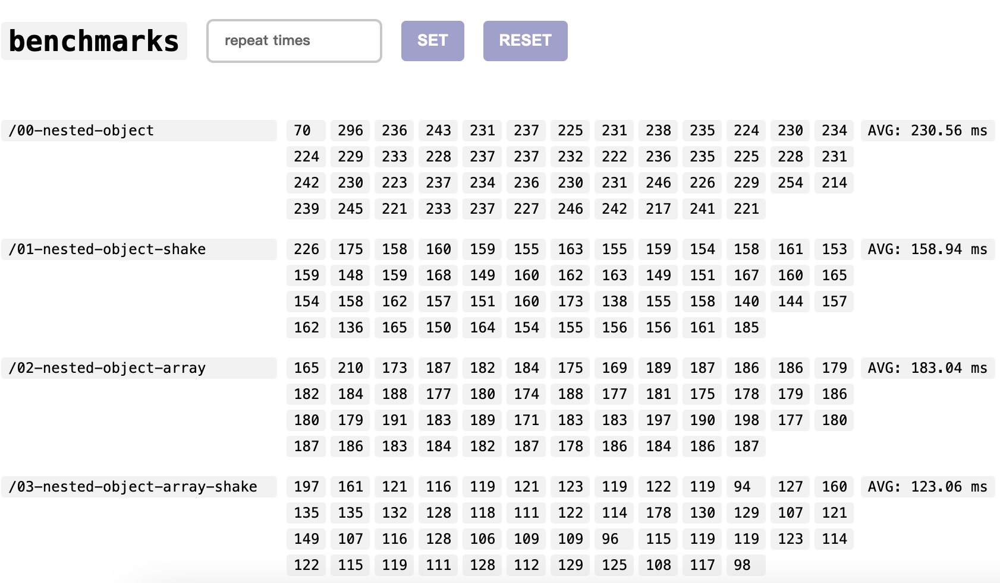

# Test Case

- The [walker](./walker.ts) reached 80% properties of object or array in each deep
- State was inject into document html with `useState`
- Runs on 14' M1 Pro & preview mode

# SSR to Full load

### data source 0





### data source 1





### group 1

# Measurement

### Same as `SSR to Full load` in nuxt devtools

> https://github.com/nuxt/devtools/blob/main/packages/devtools/src/runtime/plugins/devtools.server.ts

```ts
// server plugin
export default defineNuxtPlugin(() => {
  const ssrStart = Date.now()
  useState('ssrStart', () => ssrStart)
})
```

---

> https://github.com/nuxt/devtools/blob/main/packages/devtools/src/runtime/plugins/devtools.client.ts

```ts
// client plugin
export default defineNuxtPlugin((nuxt: any) => {
  nuxt.hook('app:mounted', () => {
    const appLoad = Date.now()
    const ssrStart = useState<number>('ssrStart')

    // result
    const ssrToFullLoadTime = appLoad - ssrStart.value
  })
})
```
