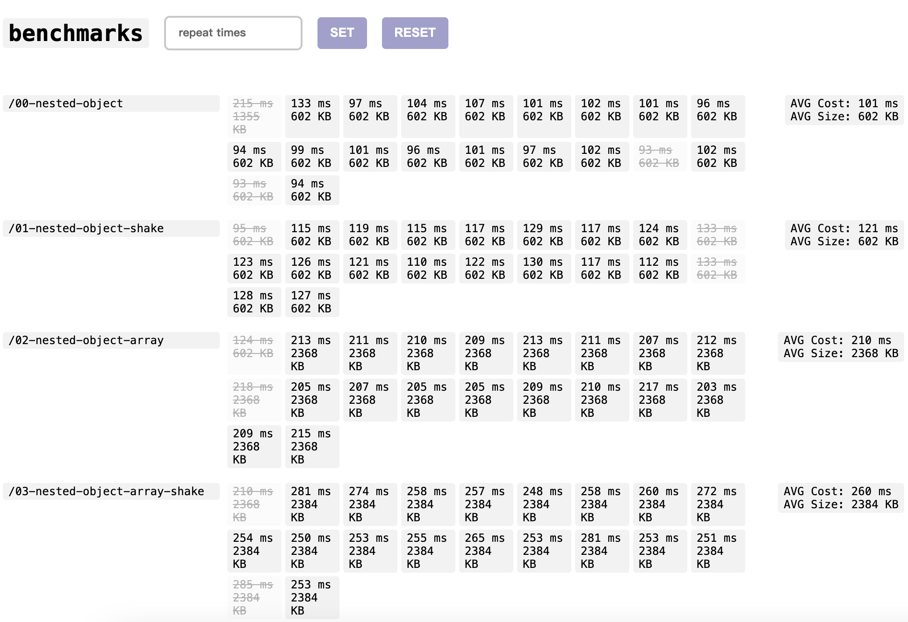

# What for & How does it work

See more detail in [useStateShake.ts](./composables/useStateShake.ts) and [object-shake repo](https://github.com/undermoonn/object-shake).

Or check out this blog https://www.undermoon.me/blog/nuxt3-serialization-optimize (Write in chinese).

# Renchmark results

Runs on 14' M1 Pro & preview mode

<details> <summary>SSR to Full load `v1.2.1` with chrome devtools close and not random walker</summary>


</details>

<details> <summary>SSR to Full load `v1.1.0` with chrome devtools open and random walker</summary>




</details>

# Measurement

### Same as `SSR to Full load` in Nuxt Devtools

> https://github.com/nuxt/devtools/blob/main/packages/devtools/src/runtime/plugins/devtools.server.ts

```js
// server plugin
export default defineNuxtPlugin(() => {
  const ssrStart = Date.now()
  useState('ssrStart', () => ssrStart)
})
```

---

> https://github.com/nuxt/devtools/blob/main/packages/devtools/src/runtime/plugins/devtools.client.ts

```js
// client plugin
export default defineNuxtPlugin((nuxt) => {
  nuxt.hook('app:mounted', () => {
    const appLoad = Date.now()
    const ssrStart = useState('ssrStart')

    // result
    const ssrToFullLoadTime = appLoad - ssrStart.value
  })
})
```

# Make your own benchmark

Check [gen.mjs](./mock/gen.mjs), change these variables

```js
// name it, nested-object or nested-object-array
const filename = undefined

// true of false
const enableArray = undefined

// object property counts
const propertyCounts = 10

// max nested object deeps
const objectDeeps = 4
```

Then

```shell
pnpm run mock
pnpm run build
pnpm run preview
```
